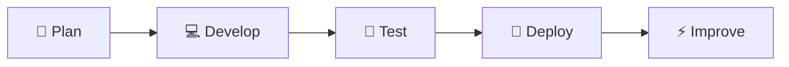
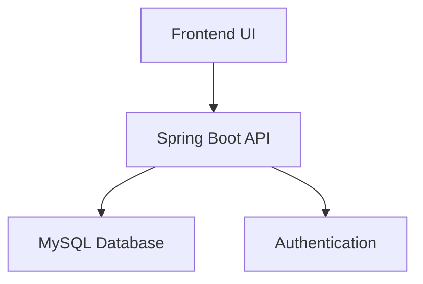

  

 

  

---

# ⚡ About Me

<table>
<tr>

<td width="50%" valign="top">

### 🚀 Current Focus

- Full Stack Development  
- Spring Boot APIs  
- Backend Architecture  
- DSA & Problem Solving  
- AI Integrated Development  
- Modern UI Systems  
- REST API Development  
- Scalable Applications  

</td>

<td width="50%" valign="top">

### 🧠 Engineering Mindset

- Continuous Learning  
- Adaptability  
- Scalable Thinking  
- Problem Solving  
- Clean Architecture  
- Modern Development Practices  
- Innovation Driven Development  

</td>

</tr>
</table>

---

# ⚔️ Tech Stack

---

# ⚡ Development Process

---

# 🌐 System Architecture

---

# 🚀 Featured Projects

<table>
<tr>

<td width="50%" valign="top">

### 🌐 Portfolio Website

- Responsive Design  
- Modern UI  
- Interactive Components  
- Smooth Animations  
- Dark Theme  
- Developer Branding  

</td>

<td width="50%" valign="top">

### 🚀 Spring Boot REST API

- CRUD Operations  
- REST APIs  
- Authentication  
- Database Integration  
- Validation & Security  
- Backend Architecture  

</td>

</tr>

<tr>

<td width="50%" valign="top">

### 🔐 Authentication System

- Login & Registration  
- Session Handling  
- Backend Validation  
- Secure Authentication  
- Database Connectivity  

</td>

<td width="50%" valign="top">

### 📚 DSA Repository

- Arrays  
- Linked Lists  
- Stack & Queue  
- Recursion  
- Sorting Algorithms  
- Problem Solving  

</td>

</tr>
</table>

---

# 📊 GitHub Analytics

 

---

# 🔥 Contribution Graph

---

# 🛠 Development Workflow

<table>
<tr>

<td width="25%" align="center">

### 📌 Plan

Requirement analysis and architecture planning.

</td>

<td width="25%" align="center">

### 💻 Build

Developing scalable frontend and backend systems.

</td>

<td width="25%" align="center">

### 🧪 Test

Debugging and improving application quality.

</td>

<td width="25%" align="center">

### 🚀 Deploy

Deployment and workflow optimization.

</td>

</tr>
</table>

---

# 🎯 Learning Roadmap

| Current Focus | Next Goal | Future Goal |
|---|---|---|
| Spring Boot | Cloud Learning | Scalable Systems |
| Full Stack Development | DevOps Basics | System Design |
| DSA & Logic | AI Integration | Advanced Engineering |

---

# ⚙️ System Status

| Component | Status |
|---|---|
| Backend Development | ✅ Active |
| Frontend Development | ✅ Active |
| DSA Practice | ✅ Running |
| AI Learning | ✅ Exploring |
| Open Source Journey | 🚀 Growing |

---

# 🧩 Developer Traits

<table>
<tr>

<td width="50%" valign="top">

### 🔹 Technical Skills

- Java Development  
- Spring Boot APIs  
- Frontend UI  
- Database Integration  
- Responsive Design  
- REST APIs  

</td>

<td width="50%" valign="top">

### 🔹 Soft Skills

- Problem Solving  
- Adaptability  
- Team Collaboration  
- Continuous Learning  
- Analytical Thinking  
- Creativity  

</td>

</tr>
</table>

---

# 🌐 Connect With Me

---

### 💻 Code • Learn • Build • Evolve

---

