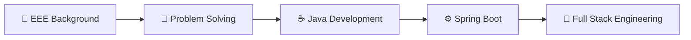

<div align="center">


<br>


<br><br>


</div>

---

# 👨‍💻 About Me

```yaml
Name: Gokulakannan
Username: RootGokul-404

Role: Java Full Stack Developer

Background:
  - Electrical & Electronics Engineering

Current Focus:
  - Spring Boot
  - REST APIs
  - Backend Architecture
  - Data Structures & Algorithms
  - Firebase Integration
  - AI Driven Development

Mission:
  Building scalable systems and modern software solutions.

Mindset:
  Learn • Build • Evolve
```

---

# ⚡ Tech Stack

<div align="center">


</div>

---

# 🚀 Featured Projects

| 🚀 Project | 💻 Tech Stack | 📖 Description |
|---|---|---|
| Personal Portfolio | HTML • CSS • JS | Portfolio website developed completely by me without AI-generated code |
| Student Management System | Java • MySQL | CRUD-based management system |
| Firebase Authentication App | Firebase • JavaScript | Login authentication with realtime database |
| Backend REST APIs | Spring Boot | Scalable backend API development |

---

# 📚 Currently Learning

```txt
✔ Advanced Spring Boot
✔ Backend Architecture
✔ System Design
✔ REST API Security
✔ AI Integrated Development
✔ Scalable Application Development
```

---

# 📊 GitHub Analytics

<div align="center">


<br><br>


</div>

---

# 🏆 GitHub Trophies

<div align="center">


</div>

---

# 🐍 Contribution Snake

<div align="center">

<picture>
  <source media="(prefers-color-scheme: dark)" srcset="https://raw.githubusercontent.com/platane/snk/output/github-contribution-grid-snake-dark.svg">
  <source media="(prefers-color-scheme: light)" srcset="https://raw.githubusercontent.com/platane/snk/output/github-contribution-grid-snake.svg">
  
</picture>

</div>

---

# 🌐 Connect With Me

<div align="center">

<a href="https://github.com/RootGokul-404">

</a>

<a href="mailto:gokulakannan7972@gmail.com">

</a>

<a href="https://instagram.com/ivan_gokula_kannan">

</a>

</div>

---

# 💭 Developer Philosophy

<div align="center">

> ### "Consistency compounds.  
> Small improvements every day create extraordinary engineers."

</div>

---

# ⚡ Engineering Journey

<div align="center">


```mermaid
flowchart LR

A[🔌 EEE Background]
--> B[🧠 Problem Solving]

B --> C[☕ Java Development]

C --> D[⚙️ Spring Boot]

D --> E[🚀 Full Stack Engineering]
```

</div>

---

# 📈 Activity Graph

<div align="center">


</div>

---

<div align="center">


### ⚡ CODE • LEARN • BUILD • EVOLVE ⚡

</div>
